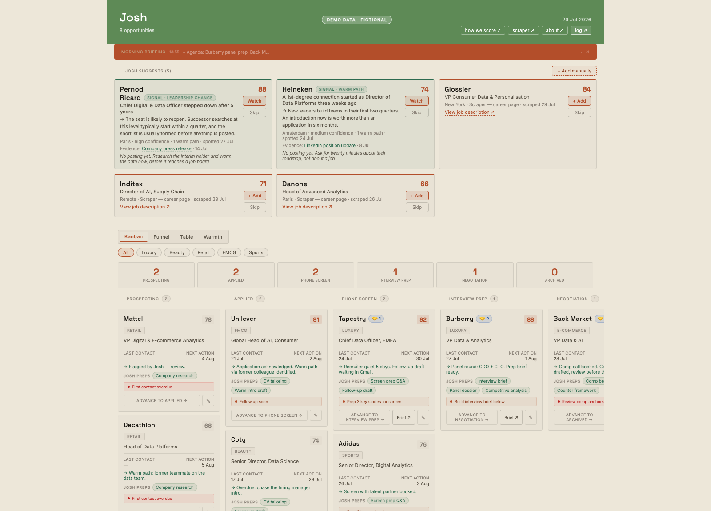

# JOSH · Your Career Transition Agent

[](LICENSE)

An open-source, autonomous Claude Code agent that runs a real executive job
search: it scrapes career pages daily, scores roles against your rubric,
briefs you every morning, drafts follow-ups, and flags recruiter emails. All
of it runs unattended on a schedule, with a hard approval gate so it never
sends anything or takes an irreversible action without you.

It grew out of a real senior-level executive search and is published here
as a reference implementation of a **daily-autonomous
Claude agent with real cron scheduling, tool use, and a human-in-the-loop
design**. "Job search" is the concrete example, but the architecture (scrape
→ score → brief → act → approve) generalizes to any workflow where you want
an agent doing real unattended work on your behalf.



*Demo data. Every role, score, date, note and contact pictured is invented.
The company names are real brands, used only to show a realistic sector mix:
nothing on this screen is a real vacancy, a real application, or a real person.*

**Try it without deploying anything:** clone the repo and open
`public/app.html?demo=1` from any static server (`npx serve public`). Demo
mode loads a fictional pipeline, skips auth, and keeps every change
in-memory, so you can drag cards, approve scraped roles, and browse the
cost tab before setting up a backend.

## Why this exists

Switching careers is a full-time job. Doing it while you already have one
leaves you maybe five focused hours a week to cover what a dedicated search
would take forty for: watching career pages, tailoring CVs, chasing
follow-ups, prepping interviews, reading the market. Speed matters too. The
strongest roles collect hundreds of applicants within days, and reacting on
day one instead of day five can change the outcome.

Josh closes that gap. It does the mechanical work overnight (watching,
scoring, cross-referencing, drafting) so your limited hours go where a human
is irreplaceable: conversations, relationships, and showing up prepared. It
is not built to replace recruiters, career coaches, or your own judgment.
It is built so the person searching alongside a demanding job can operate
like the sharpest, most proactive version of themselves, without the search
consuming their life.

And why publish it? Because the problem is common and the solution turned
out to be reusable. Career transitions are mostly navigated alone and in
private; the tooling for them deserves to be public. Publishing it also
documents a pattern I think matters beyond job searching: a small,
auditable, daily-autonomous agent with a hard approval gate, built by one
person on weekend hours for a few dollars a month. If it helps your search,
or becomes the skeleton of an agent for a completely different workflow,
it has done its job.

## Field results

Numbers from the real 4-month senior executive search in Europe that this
tool was built alongside:

| | |
|---|---|
| **~212 hours saved** | vs. manually tracking career pages, drafting follow-ups, and prepping for interviews. Over five working weeks, across the length of the search |
| **Zero missed recruiter replies** | the calendar/email cross-reference (see `pipeline-monitor.js`) catches availability requests that land with generic subject lines |
| **$3–8/month** | total Claude API cost, see [Cost](#cost) below |
| **15 career pages scraped daily** | zero-touch, at 07:00 every morning |

## Why not just use Notion / Airtable / Teal / Huntr

Those are trackers: you still have to manually check career pages, write
follow-ups, and remember what's stale. This is the layer underneath a
tracker. A scraper that finds roles you'd have missed, a scoring rubric that
filters noise before it reaches you, and an agent that reads your inbox and
calendar every morning and tells you what changed. The Kanban dashboard is
the part you look at; the automation is the part that matters.

## What it does

- **Scrapes** 15 configured career pages daily (Workday, Lever, Greenhouse,
  and generic HTML parsers included) and scores every posting against your
  rubric
- **Scores and filters**: hard-rejects non-senior titles and out-of-geography
  roles before you ever see them; everything else gets a 0–100 score
- **Spots opportunities before they are posted**: a departing Chief Data
  Officer, a restructure, a contact moving into a hiring seat. These arrive
  as *signals*, which carry evidence and a thesis instead of a job title, and
  can never masquerade as a real posting. See [docs/SIGNALS.md](docs/SIGNALS.md)
- **Briefs you** every morning: pipeline pulse, new scraper hits, stale-role
  flags, calendar/email cross-referenced against your active pipeline
- **Acts, within limits**: drafts (never sends) follow-up emails, updates
  pipeline stages when a calendar event or email clearly signals a change,
  flags anything ambiguous instead of guessing
- **Tracks warm-path connections** (LinkedIn 1st-degree at target companies)
  and its own token cost per run

## The morning briefing

The briefing is the product. Everything else exists so that once a day,
before you open your phone, the agent has already read your pipeline, your
inbox, your calendar, and the overnight scraper results, cross-referenced
them, and written the result down. Five sections, in order:

1. **Today's agenda** — calendar events plus any pipeline `nextAction` due
   today or tomorrow
2. **Pipeline pulse** — totals by stage, with stalled and overdue roles
   flagged
3. **What changed** — new roles above your score threshold, plus any signals
   worth acting on before a posting exists
4. **News and signals** — only what connects to your active targets
5. **Recommended actions** — maximum three, concrete, sequenced

The composing rule that matters most: it must read on a phone in under two
minutes. Empty sections are skipped with one line, never padded. The cron
agent writes it to KV via the `set_briefing` tool and the dashboard shows
it as the banner card at the top (demo mode includes an example). If you
prefer composing briefings interactively with Claude Code instead of the
cron, [CLAUDE.md.example](CLAUDE.md.example) has the same structure as a
session template.

## Architecture

```
Vercel Cron (daily)
   │
   ├─► /api/scrape ───────────► parses career pages → scores → KV (pending queue)
   │
   ├─► /api/gmail (POST) ─────► runs the agent: reads email + calendar,
   │                            updates pipeline, drafts replies, writes briefing
   │
   └─► /api/pipeline-monitor ─► flags stale/overdue roles, suggests next actions
                                 │
                                 ▼
                        api/agent.js (shared agentic loop)
                        Claude + tool use: get_pipeline, update_role,
                        create_gmail_draft (never sends), set_briefing, ...
                                 │
                                 ▼
                        Vercel KV (Upstash Redis) — all state lives here
                                 │
                                 ▼
                        PWA dashboard (public/app.html) — Kanban pipeline,
                        installable on mobile, password-gated
```

No framework, no build step, no database beyond KV. Just Vercel Serverless
Functions and a single-file React app loaded via CDN (Babel standalone, no
build pipeline). Deliberately dependency-free so it's easy to read top to
bottom.

## Quickstart

```bash
git clone https://github.com/juliedemoyer/josh-career-agent.git
cd josh-career-agent
```

1. Deploy to Vercel (import the repo, it deploys as-is).
2. Add the Vercel KV integration (Storage tab → Create Database → KV).
3. Set `ANTHROPIC_API_KEY`, `DASHBOARD_SECRET`, `CRON_SECRET` in Vercel env vars.
4. Answer the questions in **[docs/MAKE-IT-YOURS.md](docs/MAKE-IT-YOURS.md)**;
   they walk you through `config/profile.json` (who you are),
   `config/rubric.json` (what a great role looks like), and
   `config/targets.json` (which companies to scrape).
5. Push. Vercel redeploys and the cron jobs start running.

Full walkthrough, including optional Gmail/Calendar setup:
**[docs/SETUP.md](docs/SETUP.md)**

## Adding a company to the scraper

```bash
npm run add-company
```

Interactive, 5 questions (name, sector, career page URL, parser type,
Workday base URL if applicable), then it appends to `config/targets.json`
and tells you how to test it in isolation before your next real scrape run.
The dashboard's "Daily scraper targets" popup has an **+ Add company**
button that surfaces these same instructions in-app.
Need inspiration? `config/companies-universe.json` is a reference list of
~50 large retail and consumer companies to pick from. See
[docs/ADAPTERS.md](docs/ADAPTERS.md) for how to identify which parser a
given career page needs.

## Cost

Every agent run logs token usage to the dashboard's cost tab. The scraper
itself is free (pure keyword scoring, no LLM calls). With default cron
frequency (daily scrape + daily morning scan + daily pipeline check) on
Claude Sonnet, expect roughly **$3–8/month** depending on pipeline size and
email volume. See [docs/AGENT.md](docs/AGENT.md) for the cost-tracking
implementation and how to swap models.

## Docs

- [docs/MAKE-IT-YOURS.md](docs/MAKE-IT-YOURS.md) — the questions to answer before your first run
- [docs/SETUP.md](docs/SETUP.md) — full deployment walkthrough
- [docs/SIGNALS.md](docs/SIGNALS.md) — vacancies vs signals, the taxonomy, and the anti-hallucination rules
- [docs/ADAPTERS.md](docs/ADAPTERS.md) — how the scraper parsers work, how to add a new one
- [docs/AGENT.md](docs/AGENT.md) — the agentic loop, tool list, and the approval-gate design
- [CLAUDE.md.example](CLAUDE.md.example) — optional template if you also want to drive this
  interactively with Claude Code, separate from the deployed cron agent
- [docs/Josh-One-Pager.pdf](docs/Josh-One-Pager.pdf) — a two-page visual summary of the
  architecture, the morning loop, and the multi-agent team, if you'd rather skim than read

## What's configurable vs. what's code

Everything specific to *your* search lives in `config/`:

| File | Controls |
|---|---|
| `config/profile.json` | Your name, seniority, sectors, location, comp floor, pipeline stages |
| `config/targets.json` | Which companies get scraped and how |
| `config/rubric.json` | Scoring weights — seniority, sector fit, geography, comp scope |
| `config/companies-universe.json` | Reference list of ~50 companies to pick targets from |

Nothing in `api/` needs editing for normal use; it reads these files.

## Design decisions

Choices that shaped this more than they might look like at first glance:

- **Hard approval gate, not a permissions system.** The agent can draft an
  email but never send one, can move a pipeline card but never apply to a
  job, and new scraper hits land in a separate `pending` queue instead of
  the active pipeline. One rule (drafts/queues only, human presses send) is
  easier to trust and audit than a matrix of what the agent is and isn't
  allowed to touch.
- **Keyword scoring, not an LLM call, for the scraper.** `rubric.json` is a
  plain weighted keyword match: seniority terms, sector terms, geography,
  P&L signals. Scraping ~15 career pages daily with an LLM call per posting
  would be slower and cost real money for a job a regex-adjacent scorer
  does in milliseconds. LLM reasoning is reserved for the parts that
  actually need judgment: briefing synthesis, drafting, cross-referencing
  signals.
- **Model routing by task, not one model for everything.** Retrieval and
  filtering (fetch pipeline JSON, parse calendar events, score roles) run
  on Haiku; synthesis and drafting (the morning briefing, follow-up emails)
  run on Sonnet. This is most of the reason the whole thing costs $3–8/month
  instead of $30–80/month.
- **KV over a database.** All state (pipeline, pending queue, briefing,
  activity log, token log) is a handful of JSON blobs in Upstash Redis via
  Vercel KV. No schema migrations, no ORM, no connection pooling to reason
  about. The tradeoff (no relational queries, no multi-user support) is
  fine for a single-user tool and made the whole thing readable top to
  bottom in one sitting.
- **No build step.** The dashboard is one HTML file with React loaded from
  a CDN and Babel standalone doing in-browser JSX transform. Slower at
  runtime than a compiled bundle, faster to read, faster to fork, faster to
  deploy. `git push` is the entire release process.

## Part of a multi-agent team (optional)

Josh runs perfectly well standalone, but it was designed as one member of a
small team of domain agents: a market research analyst that owns company
intelligence, a health and energy coach that owns the calendar's human
limits, an interview story coach that owns narratives, a content ghostwriter
that owns your public voice. Each agent has its own repo, data, and schedule;
they coordinate through two lightweight channels rather than a framework:

- **A shared sprint board.** Any kanban with a small REST API works. Set
  `SPRINT_BOARD_URL` in your env and Josh's `post_sprint_task` tool starts
  posting tasks to `{SPRINT_BOARD_URL}/api/tasks`, tagged `collab:<agent>`
  when another agent should pick them up. Leave it unset and the tool is a
  clean no-op.
- **Shared notes.** Each agent writes a short end-of-day note (done, open
  loops, signals for the others) to a common folder and reads the team's
  notes at session start. Plain Markdown files are enough.

An example handoff: Josh's morning news scan spots that a target company is
restructuring → it posts a research task tagged `collab:analyst` → the
research agent investigates and drops a brief in shared notes → next
morning Josh folds that brief into the briefing and adjusts the role's
next action. No message bus, no orchestrator, just a board and a folder.

Josh is the first agent of this family to be open-sourced; the others will
follow in their own repos.

## Security notes

- The dashboard and `/api/pipeline` are protected by `DASHBOARD_SECRET`
  (a header check, not full auth: don't put anything you wouldn't want
  visible to someone who guesses or leaks that string).
- The agent's email tool (`create_gmail_draft`) **never sends**. It only
  creates drafts for you to review and send yourself.
- New scraped roles land in a `pending` queue, not your active pipeline.
  You approve or dismiss each one.
- All state lives in your own Vercel KV instance. Nothing is sent to any
  third party except the Anthropic API (for agent reasoning) and whatever
  career pages you configure it to scrape.
- **Responsible scraping.** The scraper reads public career pages and public
  posting APIs only: one fetch per company per day, no authentication
  circumvented, no personal data collected, results for your private use.
  Keep it that way — do not point it at pages behind a login or raise the
  frequency beyond what a polite visitor would do.

## Roadmap / good first issues

- [ ] Sync the dashboard's company dropdown (`public/app.html`) with
      `config/targets.json` automatically instead of maintaining two lists
- [ ] A scheduled signal generator (`/api/signals`) reading a configured source
      list — the data model, guardrails, scoring and UI already ship, see
      [docs/SIGNALS.md](docs/SIGNALS.md)
- [ ] `repost` and `seasonal` signals computed from the scraper's own history
- [ ] Additional ATS parsers (SmartRecruiters, iCIMS, Ashby)
- [ ] A `config/rubric.json` validator with helpful error messages
- [ ] Slack/Discord notification option alongside the dashboard briefing card

## License

MIT — see [LICENSE](LICENSE).
